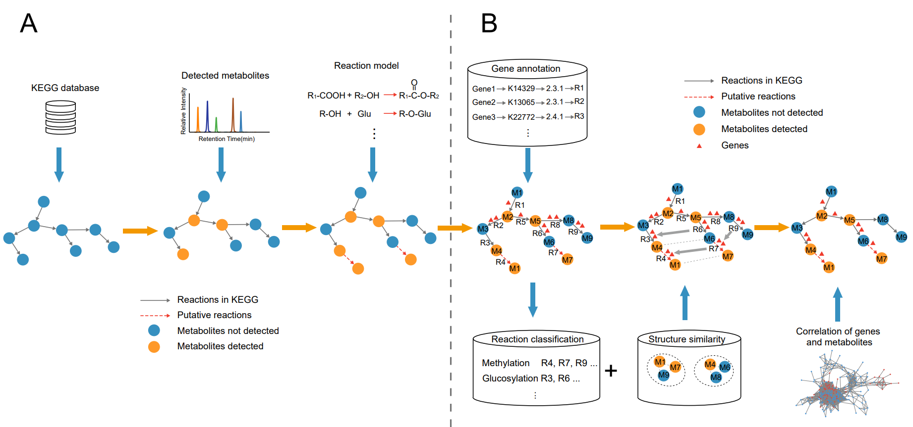

# NAGM
## Network analysis of genes and metabolites

 There are two major components of the NAGM framework: a module for the construction of a structure-guided network based on chemical modification (Fig. 1A) and an “overlap” algorithm that integrates RNA-Seq data with the comprehensive network to identify high-priority candidate genes (Fig. 1B).

    Fig. 1. Workflow of the construction of structure-guided network and candidate genes screening.

    A:    The workflow of the construction of structure-guided network.

    B:    The workflow of candidate genes screening for each reaction in the structure-guided network.

